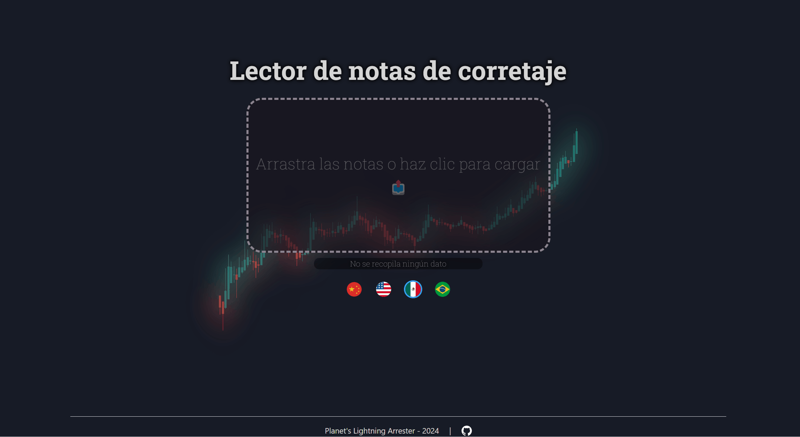

# 📈 Lector de notas de corretaje

<p align="center">
  <a href="https://github.com/planetsLightningArrester/leitor-de-notas-de-corretagem/blob/main/README.zh-cn.md"><b>简体中文</b></a> |
  <a href="https://github.com/planetsLightningArrester/leitor-de-notas-de-corretagem/blob/main/README.en-us.md"><b>English</b></a> |
  <a href="https://github.com/planetsLightningArrester/leitor-de-notas-de-corretagem/blob/main/README.es-mx.md"><b>Español</b></a> |
  <a href="https://github.com/planetsLightningArrester/leitor-de-notas-de-corretagem/blob/main/README.md"><b>Português</b></a>
</p>

<h2 align="center">Interfaz amigable para <a href="https://www.npmjs.com/package/parser-de-notas-de-corretagem"><b>parser-de-notas-de-corretagem</b></a></h2>



## 📰 Contenido

- [📈 Lector de notas de corretaje](#-lector-de-notas-de-corretaje)
  - [📰 Contenido](#-contenido)
  - [ℹ️ Acerca de](#ℹ️-acerca-de)
  - [🕹️ Cómo utilizar](#️-cómo-utilizar)
  - [🆘 Problemas posibles](#-problemas-posibles)
  - [📄 Exportar los resultados](#-exportar-los-resultados)
    - [🚨 Mi PDF no fue identificado](#-mi-pdf-no-fue-identificado)
  - [💡 Consideraciones](#-consideraciones)
  - [❤️ Colaboradores](#️-colaboradores)
  - [🙏🏻 ¿Gracias? De nada](#-gracias-de-nada)
  - [🦾 Desarrollo](#-desarrollo)
    - [🛠️ Configuración](#️-configuración)
    - [🧪 Pruebas](#-pruebas)
  - [🏦 Licencia](#-licencia)


## ℹ️ Acerca de

Lector de notas de corretaje que puede exportar a `.csv`. Probado principalmente con notas de las corredoras Rico y Clear, pero también cuenta con soporte para [Inter y Nubank](https://github.com/planetsLightningArrester/parser-de-notas-de-corretagem?tab=readme-ov-file#-support). Ignora automáticamente notas duplicadas, incluso si están en diferentes archivos PDF.

## 🕹️ Cómo utilizar

1. Ingresa a las [versiones](https://github.com/planetsLightningArrester/leitor-de-notas-de-corretagem/releases) y descarga la última versión portátil según tu sistema operativo.
2. Ejecuta la versión portátil.
3. Arrastra los PDF de las notas que deseas convertir o haz clic para buscar los PDF. Agrega todas las notas que desees.

## 🆘 Problemas posibles

- Si las notas tienen contraseña, aparecerá un mensaje y puedes ingresar hasta tres posibles contraseñas para abrir los archivos.
- Si algún activo no se identifica, aparecerá un mensaje y puedes ingresar manualmente el código, el CNPJ y si el activo es un fondo inmobiliario.
- Si encuentras problemas en la conversión, es posible que la lista de acciones no esté actualizada. Verifica si estás utilizando la versión más reciente del programa.
- Los mensajes de error se pueden encontrar en:
  - Linux: `~/.config/leitor-de-notas-de-corretagem-backend/log`
  - Mac: `~/Library/Application Support/leitor-de-notas-de-corretagem-backend/log`
  - Windows: `%APPDATA%/leitor-de-notas-de-corretagem-backend/log`

## 📄 Exportar los resultados

- Los resultados totales o individuales se pueden exportar a `.csv`.
- Puedes abrir el `.csv` directamente en Excel, pero se recomienda importarlo de otra manera para obtener una mejor visualización.
  - Abre un nuevo archivo de Excel, selecciona la pestaña `Datos` y haz clic en `De Texto/CSV` (o escribe `csv` en la búsqueda de Excel). Luego, selecciona el archivo `.csv` y termina la importación.

### 🚨 Mi PDF no fue identificado

- Las notas duplicadas no se procesan dos veces.
- Intenta usar un optimizador de PDF. Algunos PDF tienen espacios "ocultos" que no podemos ver, pero afectan al programa. Estos espacios se eliminan al utilizar optimizadores de PDF.

## 💡 Consideraciones

- Los valores totales ya incluyen los costos totales de las notas distribuidos ponderadamente.
- Los valores pueden desviarse en la zona de los centavos. Por favor, verifica siempre si el resultado está de acuerdo con lo esperado.
- Puede funcionar para otras corredoras, pero no ha sido probado.
- Si algún activo no es ON, PN, UNT, DR1, DR2 ni DR3, deberá ingresarse manualmente (consulta la sección [Problemas posibles](#problemas-posibles) o considera informar un [Problema](https://github.com/planetsLightningArrester/leitor-de-notas-de-corretagem/issues))
- Si encuentras algún otro problema, considera informar un [Problema](https://github.com/planetsLightningArrester/leitor-de-notas-de-corretagem/issues)

## ❤️ Colaboradores

Gracias a quienes me enviaron notas de negociación para las pruebas ❤️. Los datos personales no se almacenan ni se utilizan en las pruebas, solo el contenido de las notas.

## 🙏🏻 ¿Gracias? De nada

Si te ayudé, ¡envía un "¡Gracias!" 👋 a través de [pix](https://www.bcb.gov.br/en/financialstability/pix_en) 😊
> a09e5878-2355-45f7-9f36-6df4ccf383cf

## 🦾 Desarrollo

Requiere Node `>=18`.

### 🛠️ Configuración

Para ejecutar en WSL, es necesario instalar algunos paquetes:

```bash
sudo apt install libgconf-2-4 libatk1.0-0 libatk-bridge2.0-0 libgdk-pixbuf2.0-0 libgtk-3-0 libgbm-dev libnss3-dev libxss-dev libasound2 zip
```

Para reducir el ruido causado por `dbus` en WSL:

```bash
source scripts/dbus.sh
```

### 🧪 Pruebas

```bash
npm ci
npm run test
```

## 🏦 Licencia

De acuerdo con la licencia, este software no proporciona ningún tipo de garantía y su autor se exime de responsabilidades de uso. Úsalo bajo tu responsabilidad y riesgo.

[GNU GPLv3](https://choosealicense.com/licenses/gpl-3.0/)
