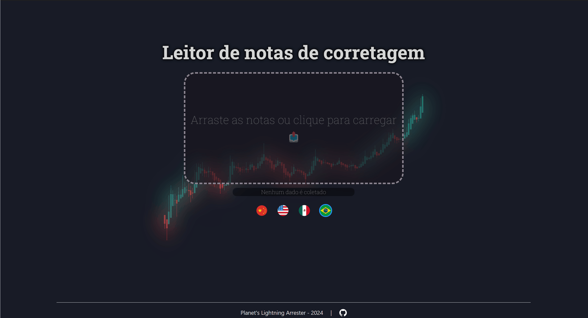

# Leitor de notas de corretagem

[](https://github.com/planetsLightningArrester/leitor-de-notas-de-corretagem/blob/main/README.zh-cn.md)
[](https://github.com/planetsLightningArrester/leitor-de-notas-de-corretagem/blob/main/README.en-us.md)
[](https://github.com/planetsLightningArrester/leitor-de-notas-de-corretagem/blob/main/README.es-mx.md)
[](https://github.com/planetsLightningArrester/leitor-de-notas-de-corretagem/blob/main/README.md)

Interface amigável do [parser-de-notas-de-corretagem](https://www.npmjs.com/package/parser-de-notas-de-corretagem).



## Sobre
Leitor de notas de corretagem que pode exportar para `.csv`. Testado majoritariamente com as notas das corretoras Rico e Clear, mas também possui suporte para Inter. Automaticamente ignora notas duplicadas, mesmo que em PDFs diferentes.

## Modo de usar
1. Entre nas [releases](https://github.com/planetsLightningArrester/leitor-de-notas-de-corretagem/releases) e baixe a última versão portátil de acordo com o seu sistema operacional
2. Execute o portátil. 
3. Arraste os PDFs das notas que deseja converter ou clique para procurar pelos PDFs. Adicione quantas notas quiser.

## Possíveis problemas
- Se as notas possuírem senha, uma mensagem irá aparecer e você pode colocar até três possíveis senhas para abrir os arquivos.
- Se algum ativo não for identificado, uma mensagem irá aparecer e você pode entrar manualmente qual o código, o CNPJ e se o ativo é um fundo imobiliário.
- Caso encontre problemas na conversão, pode ser que a lista de ações não esteja atualizada. Verifique se você está utilizando a versão mais recente do programa.
- As mensagens de erro podem ser encontradas em:
  - Linux: `~/.config/leitor-de-notas-de-corretagem-backend/log`
  - Mac: `~/Library/Application Support/leitor-de-notas-de-corretagem-backend/log`
  - Windows: `%APPDATA%/leitor-de-notas-de-corretagem-backend/log`

## Exportando os resultados
- Os resultados totais ou individuais podem ser exportados para `.csv`.
- É possível abrir o `.csv` diretamente no Excel, mas é recomendado importar de outra maneira para que se obtenha uma melhor visualização.
   - Abra um novo arquivo do Excel, selecione a aba `Dados` e clique em `De Text/CSV` (ou digite `csv` na busca do Excel). Então, basta selecionar o arquivo `.csv` e terminar a importação

### Meu PDF não foi identificado
- Notas duplicadas não são processadas duas vezes
- Tente usar um otimizador de PDF. Alguns PDFs ficam com espaços "escondidos" que não conseguimos ver, mas atrapalha o programa. Esses espaços são removidos quando usamos otimizadores de PDFs.

## Considerações
- Os valores totais já incluem os custos totais das notas distribuídos ponderadamente
- Os valores podem desviar na casa dos centavos. Por favor, sempre verifique se o resultado está de acordo com o esperado.
- Pode funcionar para outras outras corretoras, mas não foi testado.
- Caso algum ativo não seja ON, PN, UNT, DR1, DR2 nem DR3, terá que ser inserida manualmente (veja a sessão [Possíveis problemas](#possíveis-problemas) ou considere reportar um [Issue](https://github.com/planetsLightningArrester/leitor-de-notas-de-corretagem/issues))
- Se encontrar algum outro problema, considere reportar um [Issue](https://github.com/planetsLightningArrester/leitor-de-notas-de-corretagem/issues)

## Contribuidores
Obrigado à quem me enviou notas de negociação para os testes ❤️. Os dados pessoais não são armazenados nem são usados em testes, apenas o conteúdo das notas.

## Obrigado? De nada
Se te ajudei, manda um "Valeu!" 👋 pelo [pix](https://www.bcb.gov.br/en/financialstability/pix_en) 😊
> a09e5878-2355-45f7-9f36-6df4ccf383cf

## Desenvolvimento

Requer Node `>=18`.

### Setup
Para rodar no WSL, é necessário instalar alguns pacotes:

```bash
sudo apt install libgconf-2-4 libatk1.0-0 libatk-bridge2.0-0 libgdk-pixbuf2.0-0 libgtk-3-0 libgbm-dev libnss3-dev libxss-dev libasound2 zip
```

### Testes

```bash
npm ci
npm run test
```

## Licença

Conforme licença, esse software não fornece nenhum tipo de garantia e seu autor se exime de responsabilidades de uso. Use sob sua responsabilidade e risco.

[GNU GPLv3](https://choosealicense.com/licenses/gpl-3.0/)
