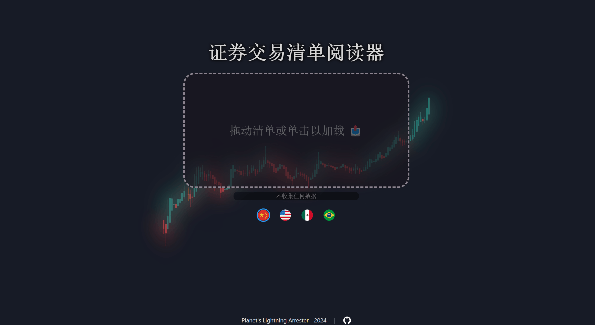

# 证券交易清单阅读器

<p align="center">
  <a href="https://github.com/planetsLightningArrester/leitor-de-notas-de-corretagem/blob/main/README.zh-cn.md"><b>简体中文</b></a> |
  <a href="https://github.com/planetsLightningArrester/leitor-de-notas-de-corretagem/blob/main/README.en-us.md"><b>English</b></a> |
  <a href="https://github.com/planetsLightningArrester/leitor-de-notas-de-corretagem/blob/main/README.es-mx.md"><b>Español</b></a> |
  <a href="https://github.com/planetsLightningArrester/leitor-de-notas-de-corretagem/blob/main/README.md"><b>Português</b></a>
</p>

<h2 align="center"><a href="https://www.npmjs.com/package/parser-de-notas-de-corretagem"><b>parser-de-notas-de-corretagem</b></a> 的友好界面。</h2>



## 关于
证券交易清单阅读器，可导出为 `.csv`。主要与Rico和Clear经纪商的清单一起进行测试，但也支持Inter。即使在不同的PDF中，也会自动忽略重复的清单。

## 使用方法
1. 进入[版本发布](https://github.com/planetsLightningArrester/leitor-de-notas-de-corretagem/releases)并下载适用于您操作系统的最新便携版本。
2. 运行便携版本。
3. 拖动您要转换的清单的PDF，或单击以浏览PDF。添加任意数量的清单。

## 可能的问题
- 如果清单有密码，将显示一条消息，您可以输入最多三个可能的密码以打开文件。
- 如果未识别任何资产，将显示一条消息，您可以手动输入代码、CNPJ以及资产是否为不动产基金。
- 如果在转换过程中遇到问题，可能是股票列表未更新。请检查您是否使用最新版本的程序。
- 错误消息可在以下位置找到：
  - Linux：`~/.config/leitor-de-notas-de-corretagem-backend/log`
  - Mac：`~/Library/Application Support/leitor-de-notas-de-corretagem-backend/log`
  - Windows：`%APPDATA%/leitor-de-notas-de-corretagem-backend/log`

## 导出结果
- 总体或个别结果可导出为 `.csv`。
- 您可以直接在Excel中打开 `.csv`，但建议以其他方式导入以获得更好的可视化效果。
   - 打开一个新的Excel文件，选择“数据”选项卡，单击“从文本/CSV”（或在Excel搜索中键入 `csv`）。然后，选择 `.csv` 文件并完成导入。

### 我的PDF未被识别
- 重复的清单不会被处理两次。
- 尝试使用PDF优化器。有些PDF有“隐藏”的空格，我们无法看到但会干扰程序。使用PDF优化器时，这些空格将被删除。

## 注意事项
- 总值已经包括清单的总成本，按比例分配。
- 金额可能在几分之一的范围内偏离。请始终验证结果是否符合预期。
- 可能适用于其他经纪商，但尚未经过测试。
- 如果某个资产不是ON、PN、UNT、DR1、DR2或DR3，则必须手动输入（请参阅[可能的问题](#可能的问题)部分，或考虑报告[问题](https://github.com/planetsLightningArrester/leitor-de-notas-de-corretagem/issues))
- 如果遇到其他问题，请考虑报告[问题](https://github.com/planetsLightningArrester/leitor-de-notas-de-corretagem/issues)

## 贡献者
感谢那些为我提供交易清单进行测试的人 ❤️。个人数据不存储，也不用于测试，仅使用清单的内容。

## 感谢？不客气
如果我帮到了你，请通过 [pix](https://www.bcb.gov.br/en/financialstability/pix_en) 发送一个“感谢！”👋
> a09e5878-2355-45f7-9f36-6df4ccf383cf

## 开发

需要 Node `>=18`。

### 设置
要在WSL上运行，需要安装一些软件包：

```bash
sudo apt install libgconf-2-4 libatk1.0-0 libatk-bridge2.0-0 libgdk-pixbuf2.0-0 libgtk-3-0 libgbm-dev libnss3-dev libxss-dev libasound2 zip
```

为了减少WSL上的`dbus`引起的噪音：

```bash
source scripts/dbus.sh
```

### 测试

```bash
npm ci
npm run test
```

## 许可证

根据许可证，此软件不提供任何保证，作者对使用不承担任何责任。请在自己的责任和风险下使用。

[GNU GPLv3](https://choosealicense.com/licenses/gpl-3.0/)